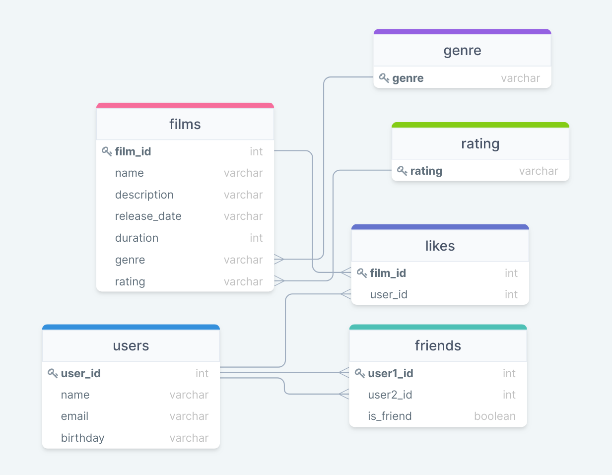

# java-filmorate
Template repository for Filmorate project.


Database diagramm: 



В диаграмме можно выделить таблицу friends, хранящей статус отношений
между двумя пользователями. Ключ составной: user1_id и user2_id.
user1_id хранит id пользователя, оправившего запрос на дружбу пользователю
с id user2_id.

Examples of database queries:

GET All users :
```SQL
SELECT user_id,  
       name,  
       email,  
       birthday  
FROM users  
ORDER BY user_id  
```
GET user with id = 1 all friends :
```SQL
SELECT DISTINCT u.user_id,
                u.name,
                u.email,
                u.birthday
FROM friends AS f
         INNER JOIN users AS u ON (u.user_id = f.user1_id
    OR u.user_id = f.user2_id)
    AND (f.user1_id = 1
        OR f.user2_id = 1)
WHERE users.user_id != 1
  AND friends.is_friend
ORDER BY u.user_id       
 ```
 GET mutual friends for users with id = 1 and id = 2 :
 ```SQL
 SELECT DISTINCT u.user_id,
                 u.name,
                 u.email,
                 u.birthday
 FROM friends AS f
          INNER JOIN users AS u ON (u.user_id = f.user1_id
     OR u.user_id = f.user2_id)
     AND (f.user1_id = 1
         OR f.user2_id = 1
         OR f.user1_id = 2
         OR f.user2_id = 2)
 WHERE users.user_id != 1
  AND users.user_id != 2
  AND COUNT(users.user_id) = 2
  AND friends.is_friend
 ORDER BY u.user_id
 ```
GET All films

```SQL
SELECT f.film_id,
       f.name,
       f.description,
       f.release_date,
       f.duration,
       g.genre,
       r.rating
FROM films AS 
ORDER BY f.film_id
```

GET All likes to film with id = 1
```SQL
SELECT l.user_id,
       u.name,
       u.email,
       u.birthday
FROM likes AS l
INNER JOIN USER AS u ON l.user_id = u.user_id
WHERE film_id = 1
ORDER BY l.user_id
```

